# Arduino Game Console

This Arduino project implements a simple game console featuring two classic games: Pong and Car Race. It utilizes an Adafruit TFT display along with a Funduino joystick  and pushbuttons arduino UNO.

## Features

- Two classic games: Pong and Car Race.
- Intuitive menu interface for game selection.
- Real-time gameplay with collision detection and scoring.
- Supports joystick and buttons for user interaction.

## Hardware Requirements

- Arduino board (e.g., Arduino Uno)
- Adafruit 1.44 inch TFT display (compatible with ST7735 driver)
- Funduino Joystick module
- Wires and breadboard for connections
## Configuration for Funduino Joystick module

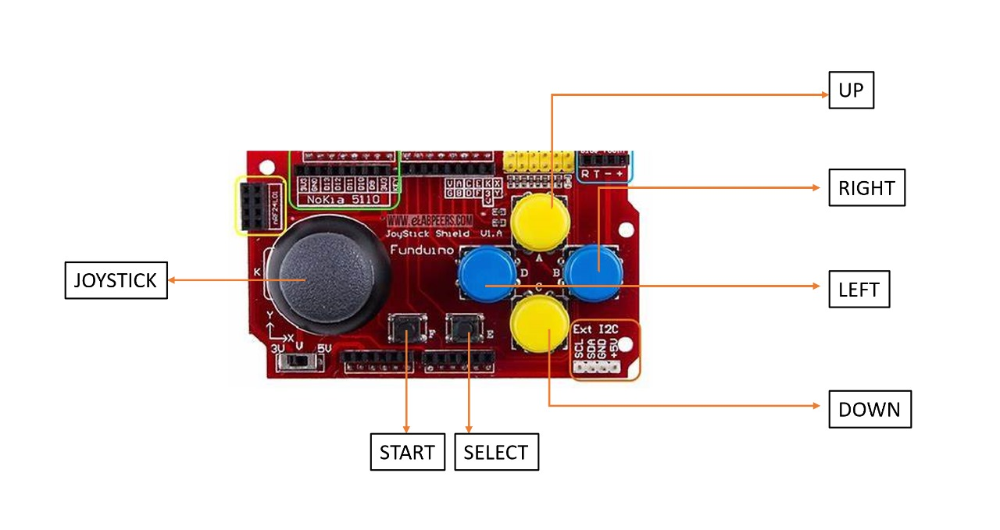
## Installation

1. Connect the Adafruit TFT display and other hardware components to the Arduino board following the provided wiring diagram.
2. Install the necessary libraries:
   - Adafruit GFX Library
   - Adafruit ST7735 Library
3. Upload the provided Arduino sketch (`.ino` file) to the Arduino board using the Arduino IDE or compatible software.
4. Ensure all connections are secure and power on the system.

## Usage

1. Upon powering on the device, a welcome screen will be displayed on the TFT screen.
2. Navigate through the menu using the joystick and select a game by pressing the appropriate button.
3. Follow the on-screen instructions to play the selected game.
4. Enjoy the gameplay experience!

## Examples

First Display (Wait 6sec it will redirect to next interface)
 
 
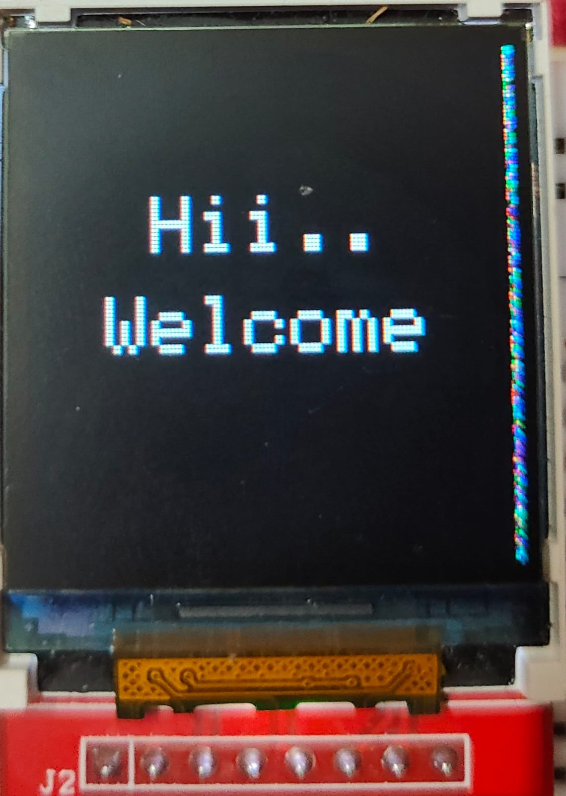

Select game Display(use up and down button to move the selector button and enter select button to go with selected game)
 
 
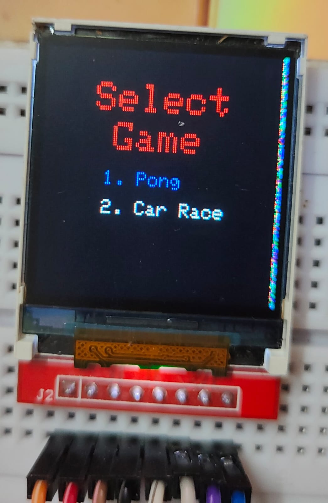
 

Pong game entry (use up and down button to move the selector button and enter select button to go with selected option)
 
 
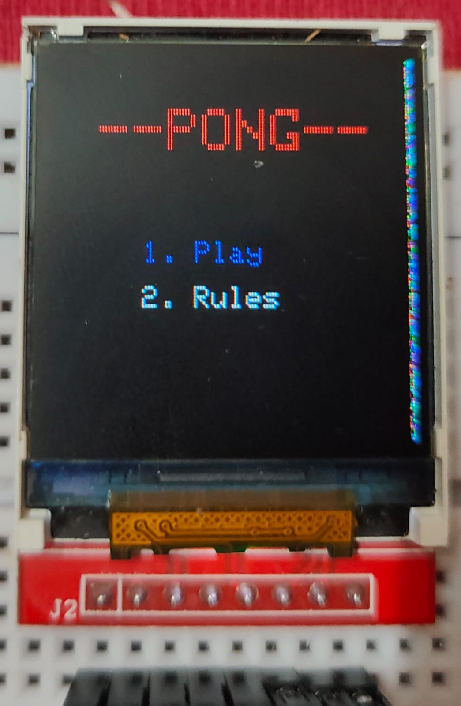
 

Pong game Rules (Wait 6sec it will redirect to next interface)
 
 
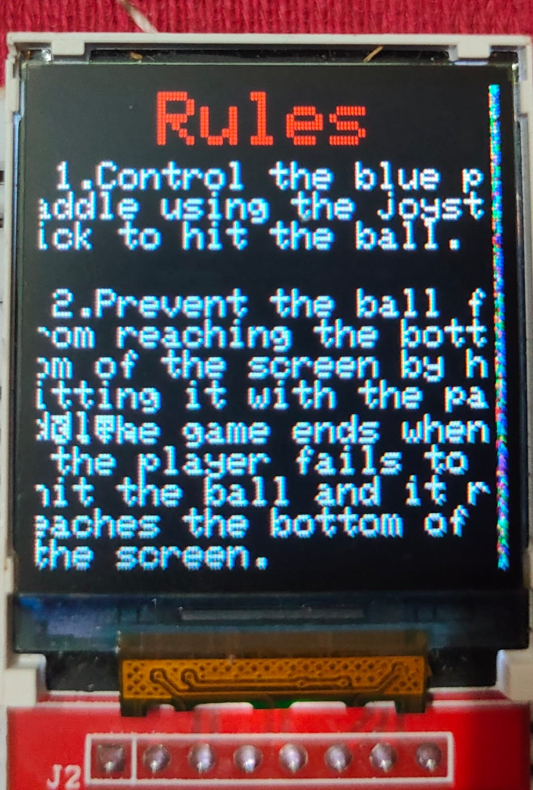
 

Pong game display (use joystick to move blue paddle)
 
 
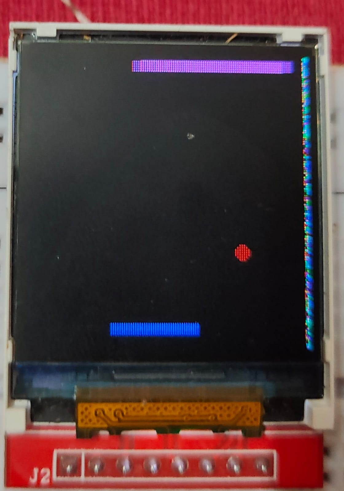
 

Pong game win (walt 5 sec to move into selcted game interface )
 
 
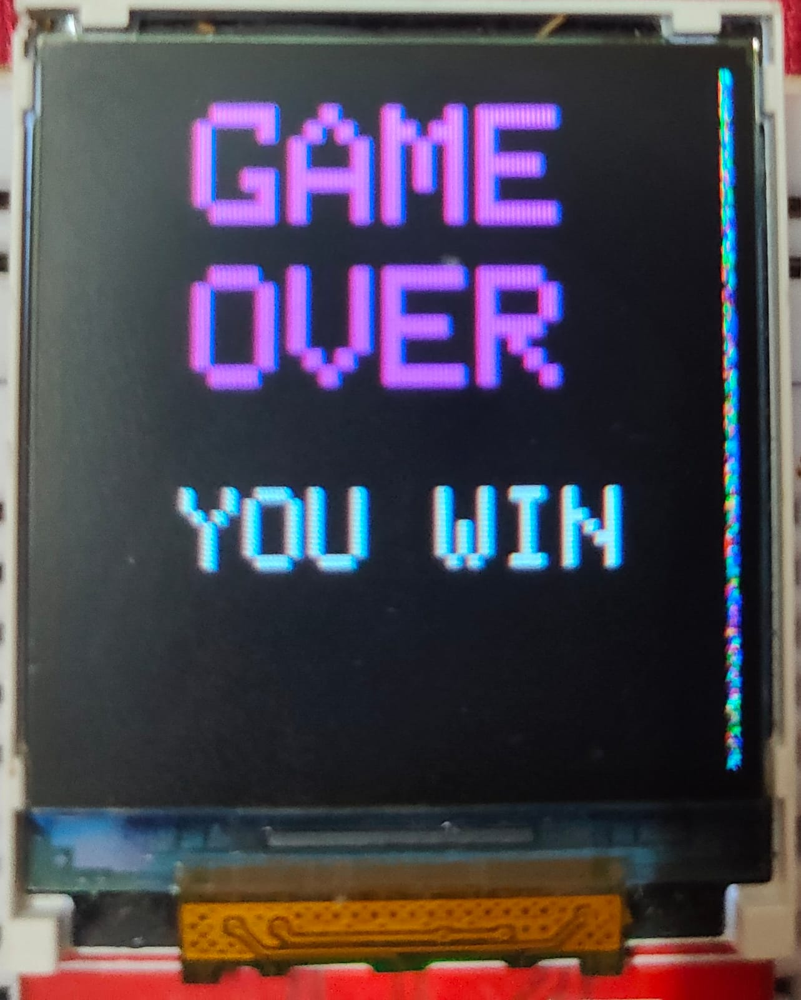
 

Pong game lost (walt 5 sec to move into selcted game interface )
 
 
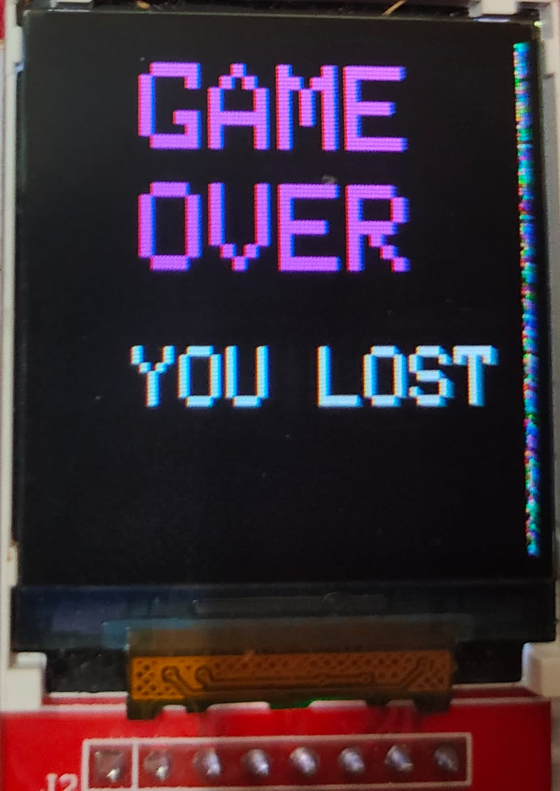
 

Car Race game entry (use up and down button to move the selector button and enter select button to go with selected option)
 
 
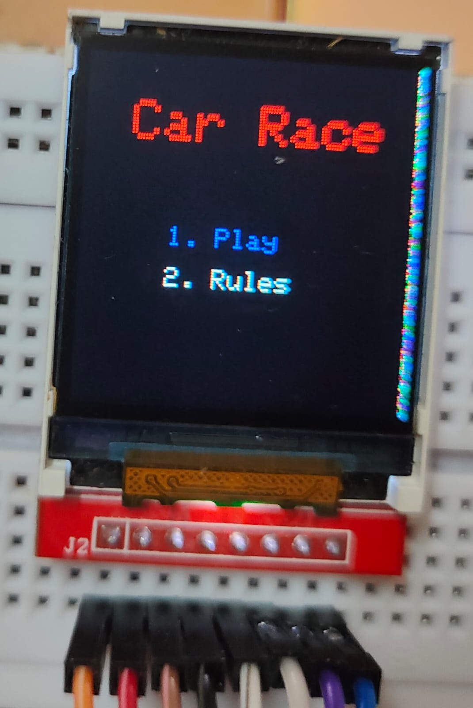
 

Car Race rules (Wait 6sec it will redirect to next interface)
 
 
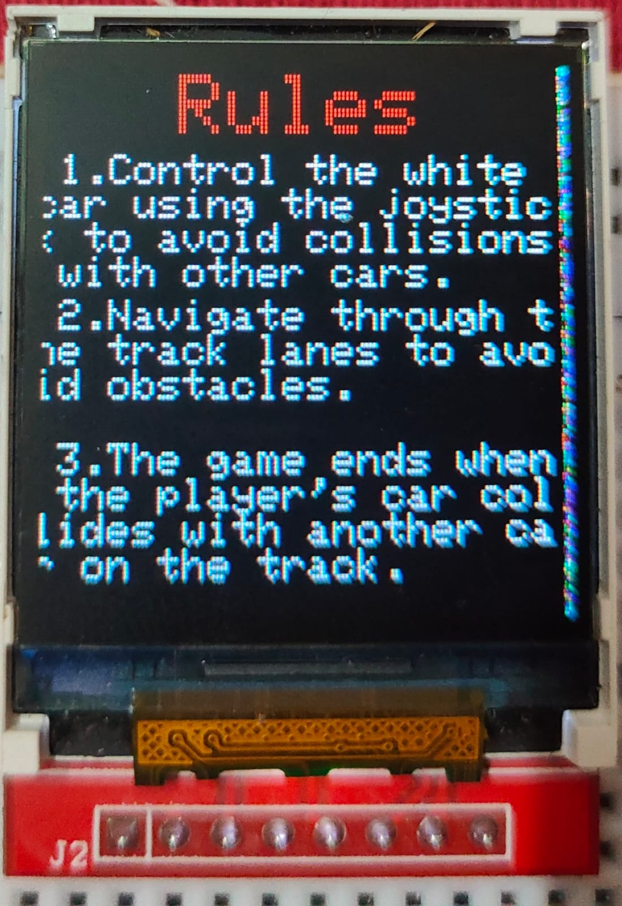
 

Car game display (use joystick to move white car)
 
 
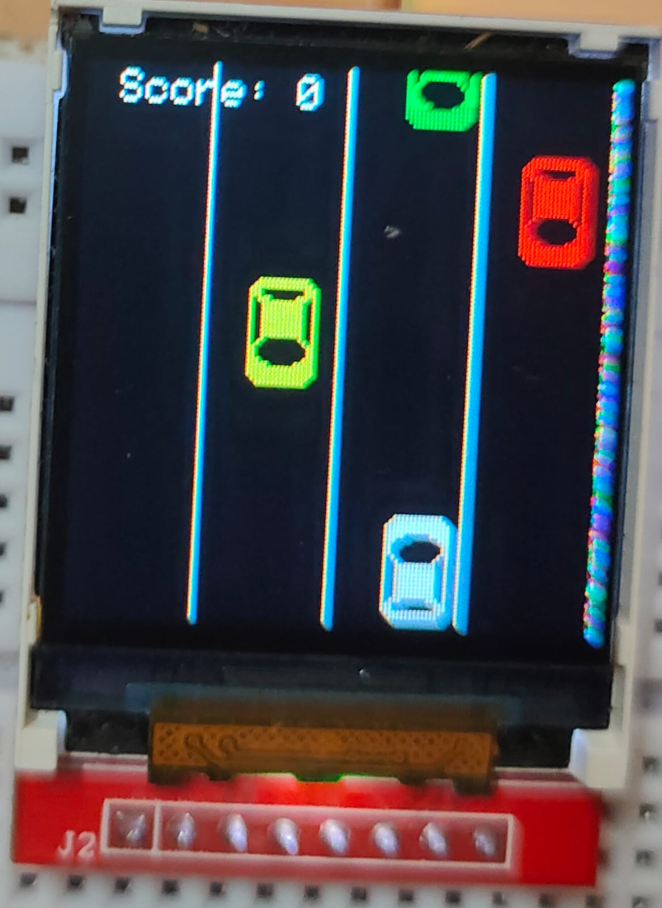

Car game score (walt 5 sec to move into selcted game interface )
 
 
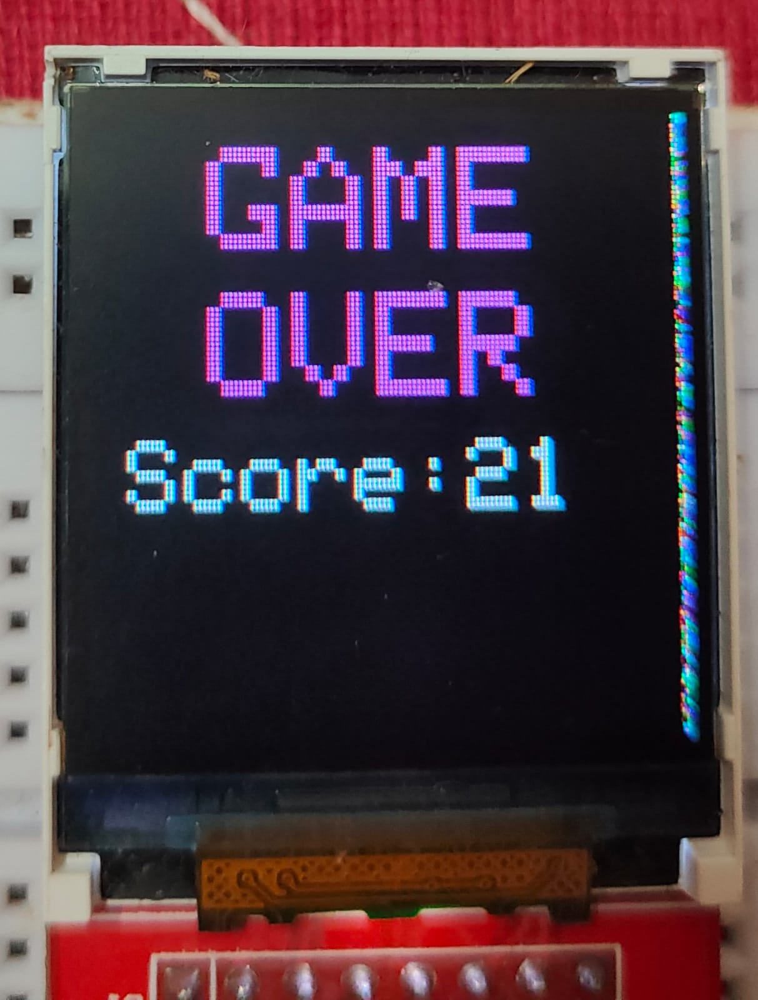

